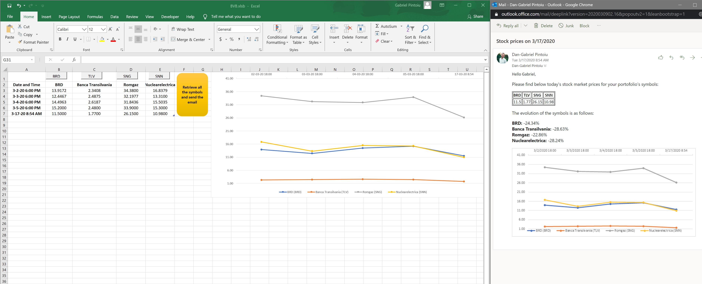

# RetrieveBVB_SharePrice-using VBA
Retrieve the share price from the Bucharest Stock Market website (bvb.ro - Bursa de Valori Bucuresti), populate a chart showing share's performance and send it through email, along with shares % increase or decrease based on the current and previous retrieved values.

 
 
 

